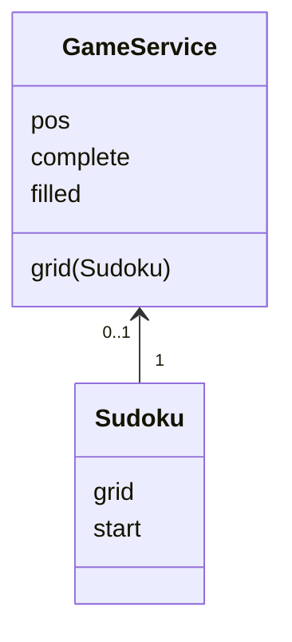
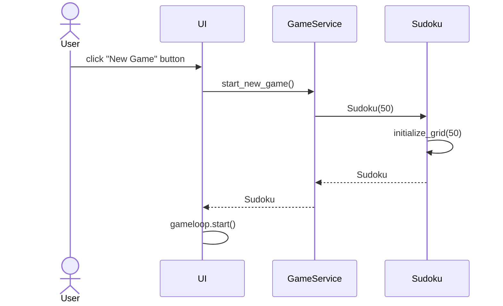

# Arkkitehtuuri

## Sovelluslogiikka

Sovelluslogiikan muodostavat logiikkaluokka GameService ja Sudoku -luokka, joka kuvastaa sudokuruudukkoa:

GameService -luokka vastaa myös kokonaisuudesta. Käyttöliittymä kutsuu sen metodeja. _GameService_ hoitaa pelin tallennusta _repositories_ -kansion _SudokuRepository_ -luokan avulla, jonka se saa konstruktorikutsussa.

## Käyttölittymä

Käyttöliittymä on toteutettu pygame -kirjastolla ja siinä on kaksi erilaista näkymää:
- aloitusvalikko
- peliruutu

Aloitusvalikko on omassa Menu -luokassaan ja sillä on oma peli-silmukka ja tapahtumankäsittely. Peliruutu on toteutettu erillisillä luokilla mm. GameLoop ja Renderer. Ne vastaavat pelisilmukasta ja tapahtumien käsittelystä, sekä kuvan piirtämisestä. Sekä aloitusvalikko että peliruutu kutsuvat sovelluslogiikasta vastaavan luokan GameService metodeja.

## Tietojen pysyväistallennus

Repositories -kansion _SudokuRepository_ -luokka vastaa keskeneräisen pelin tallentamisesta CSV -tiedostoon. 

### Tiedostot

Sovellus tallentaa keskeneräisen pelin erilliseen tiedostoon. Tiedoston nimi on määritelty sovelluksen juureen sijoitetussa konfiguraatiotiedostossa [.env](../.env).

## Päätoiminnallisuudet

### Uuden pelin aloittaminen

Kun käyttäjä valitsee aloitusvalikossa painikkeen "New Game", etenee sovellus näin:

Käyttöliittymää kuvaava luokka UI sisältää muitakin luokkia, kuten GameLoop ja Renderer, jotka hoitavat pelin tapahtumien käsittelyn ja kuvan piirtämisen. Kun uusi peli on alustettu logiikkaluokassa GameService, niin käyttöliittymä aloittaa pelisilmukan.
