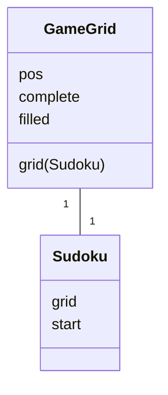

# Arkkitehtuuri

## Sovelluslogiikka

```mermaid
classDiagram
   GameGrid "1" -- "1" Sudoku
   class Sudoku{
    grid 
    start
   }
   class GameGrid{
    grid(Sudoku)
    pos
    complete
    filled
   }

``` 
