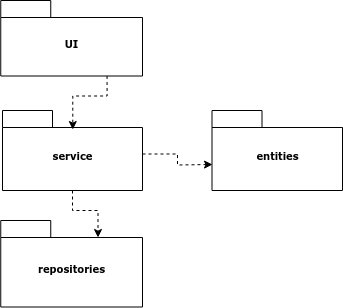
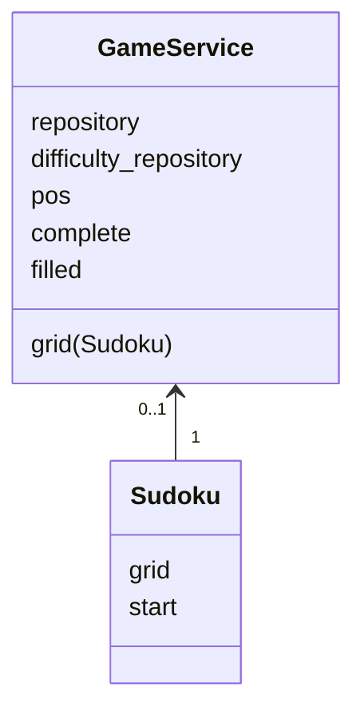
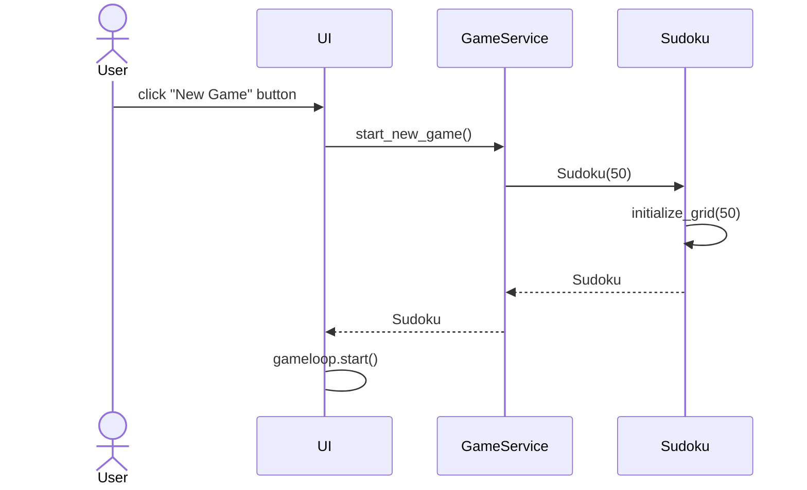
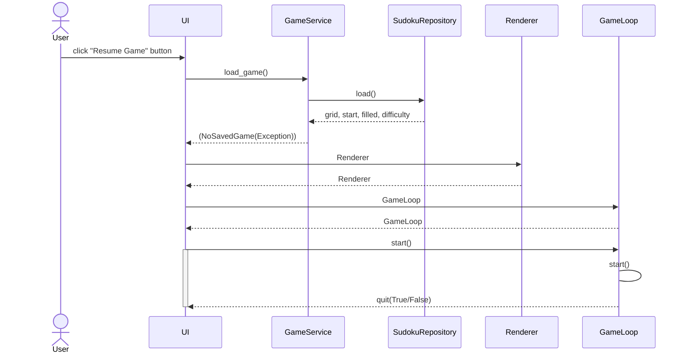
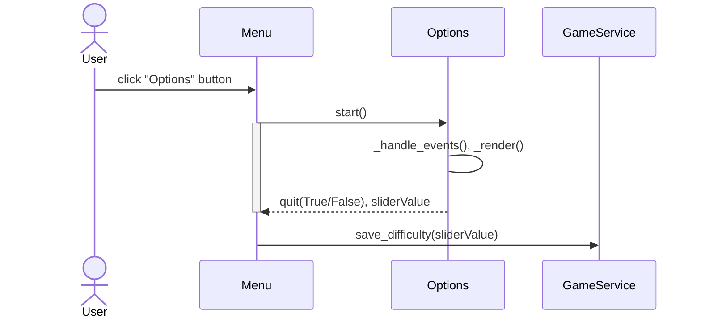

# Arkkitehtuuri

## Rakenne

Sovelluksen rakennetta kuvaa pakkausrakenne:

_UI_ sisältää käyttöliittymästä vastaavan koodin, _service_ sovelluslogiikasta vastaavan koodin, _entities_ pelin Sudoku -ruudukkoa kuvaavan koodin ja _repositories_ tiedon pysyväistallennuksesta vastaavan koodin.

## Sovelluslogiikka

Sovelluslogiikan muodostavat logiikkaluokka GameService ja Sudoku -luokka, joka kuvastaa sudokuruudukkoa:

GameService -luokka vastaa myös kokonaisuudesta. Käyttöliittymä kutsuu sen metodeja. _GameService_ hoitaa pelin tallennusta _repositories_ -kansion _SudokuRepository_ -luokan avulla ja vaikeustason tallenusta _DifficultyRepository_ -luokan avulla, jotka se saa konstruktorikutsussa.

## Käyttölittymä

Käyttöliittymä on toteutettu pygame -kirjastolla ja siinä on kolme erilaista näkymää:
- aloitusvalikko
- peliruutu
- asetusvalikko 

Aloitusvalikko on omassa Menu -luokassaan ja sillä on oma peli-silmukka ja tapahtumankäsittely. Peliruutu on toteutettu erillisillä luokilla mm. GameLoop ja Renderer. Ne vastaavat pelisilmukasta ja tapahtumien käsittelystä, sekä kuvan piirtämisestä. Peliruudulta pääsee takaisin aloitusvalikkoon. Asetusvalikkoa kuvaa luokka Options, jolla on myös oma peli-silmukka ja tapahtumakäsittely. Menu, Options ja GameLoop luokat kutsuvat sovelluslogiikasta vastaavan luokan GameService metodeja.

## Tietojen pysyväistallennus

Repositories -kansion _SudokuRepository_ -luokka vastaa keskeneräisen pelin tallentamisesta CSV -tiedostoon. Peli tallennetaan tiedostoon muotoon:

difficulty;x;filled;y\
grid\
1;2;3;4;5;6;7;8;9\
2;3;5;7;4;1;6;9;8\
.\
.\
.\
start\
0;3;6;0;4;7;0;0;3\
.\
.\
.

Otsikot kertovat, mistä tiedosta on kyse ja sitten ruudukon rivit ovat omalla riveillään.

_DifficultyRepository_ -luokka vastaa asetetun vaikeustason tallennuksesta CSV -tiedostoon. Tieto tallennetaan yhdelle riville muodossa:

difficulty;x

### Tiedostot

Sovellus tallentaa keskeneräisen pelin ja asetetun vaikeustason erillisiin tiedostoihin. Tiedostojen nimet on määritelty sovelluksen juureen sijoitetussa konfiguraatiotiedostossa [.env](../.env).

## Päätoiminnallisuudet

### Uuden pelin aloittaminen

Kun käyttäjä valitsee aloitusvalikossa painikkeen "New Game", etenee sovellus näin:

Käyttöliittymää kuvaava luokka UI sisältää muitakin luokkia, kuten GameLoop ja Renderer, jotka hoitavat pelin tapahtumien käsittelyn ja kuvan piirtämisen. Kun uusi peli on alustettu logiikkaluokassa GameService, niin käyttöliittymä aloittaa pelisilmukan.

### Pelin lataaminen/jatkaminen

Käyttäjän painaessa aloitusvalikon painiketta "Resume Game", toimii sovellus näin:

Tässä on kuvattuna tapahtuma, kun käyttäjä painaa Resume Game -nappia. Jos peliä ei ole tallennettuna, GameService nostaa NoSavedGame -poikkeuksen ja UI:n aloitusvalikossa ei tapahdu mitään. Muulloin tapahtumat etenevät kaavion tavoin.

### Vaikeustason muuttaminen

Kun käytäjä painaa "Options" nappia, etenee sovellus näin:

Menu -luokka jatkaa omaa silmukkaansa näiden tapahtumien jälkeen, jos quit oli False. Muulloin poistuu omasta silmukastaan ja sovelluksen suoritus loppuu.
