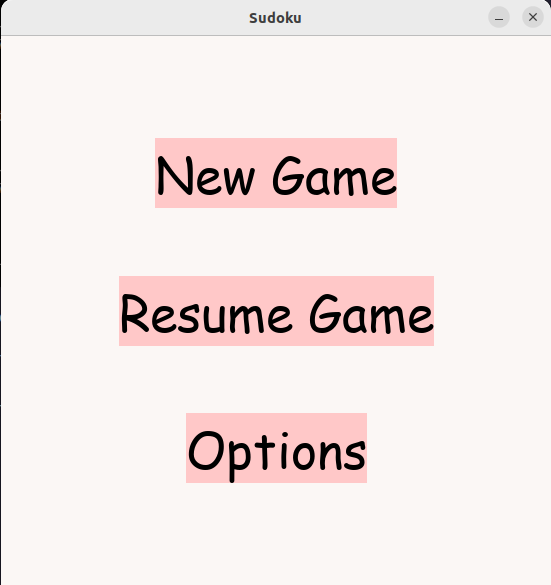
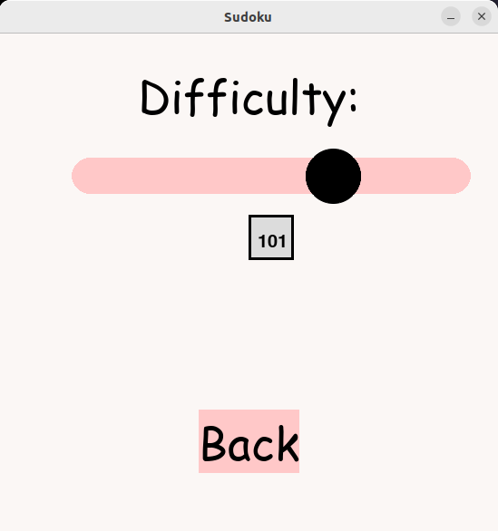
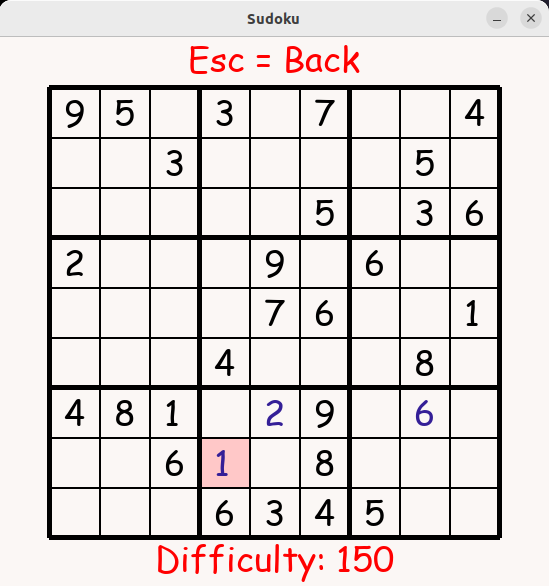

# Käyttöohje

## Lataaminen

Lataa ohjelman uusin versio [täältä](https://github.com/nikomakir/ot-harjoitustyo/releases). Kohdan _Assets_ alta _Source Code_.

## Asennus

Asenna ohjelman riippuvuudet komennolla:

```
poetry install

```

## Käynnistys

Nyt ohjelman pystyy suorittaa komennolla: 

```
poetry run invoke start

```

## Konfigurointi

Peli tallentaa keskeneräisen pelin kansioon _data_ oletusarvoisella nimellä _sudoku.csv_ ja asetetun vaikeustason oletusarvoisella nimellä _difficulty.csv_. Jos tiedostoja ei ole olemassa, ohjelma luo ne automaattisesti.
Konfiguraatiotiedostossa _.env_ pystyy tiedoston nimiä muuttamaan ja tiedostojen muoto on:

```
SUDOKU_FILENAME=sudoku.csv
DIFFICULTY_FILENAME=difficulty.csv

```
## Pelin pelaaminen

### Aloitus

Pelin käynnistyttyä avautuu aloitusruutu:



Aloitusvalikosta pystyy käynnistämään uuden pelin nappia _New Game_ painamalla. _Resume Game_ -nappi avaa keskeneräisen pelin, jos sellainen on saatavilla.
Jos ei ole, niin mitään ei tapahdu. _Options_ nappi avaa uuden näkymän, jossa voi muuttaa vaikeustasoa.

## Options -valikko

Aloitusruudulta pääsee seuraavanlaiseen näkymään, kun valitsee _Options_:



Liukuvalikko kuvastaa asettua vaikeustasoa. Sitä voi liikuuttaa 1:n ja 150:n välillä. Korkeampi numero kuvastaa vaikeampaa peliä. Takaisin aloitusruudulle pääsee _Back_ nappia painamalla.

### Pelaaminen

Kun on aloittanut pelin, näkymä on seuraavanlainen:



Pelissä aluksi valmiina olevat numerot ovat mustalla ja pelaajan itse täyttämät numerot sinisellä. Nykyistä valintaa kuvastaa ruudun vaaleanpunainen tausta.
Valintaa voi liikuttaa nuolinäppäimillä. Painamalla valinnan kohdalla _BackSpace_ tai _Delete_-näppäintä, voi numeron poistaa, ellei se ole aloitusnumero. Ruudun alaosassa näkyy _Difficulty_ tekstin jälkeen kyseisen pelin vaikeusaso.
_Esc_ -näppäimellä pääsee takaisin aloitusruudulle.

