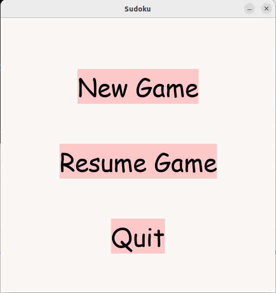
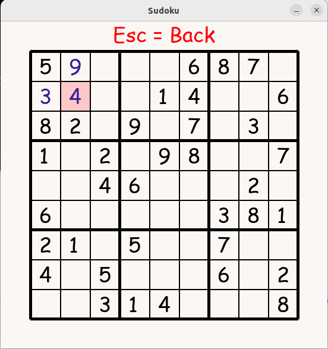

# Käyttöohje

## Lataaminen

Lataa ohjelman uusin versio [täältä](https://github.com/nikomakir/ot-harjoitustyo/releases). Kohdan _Assets_ alta _Source Code_.

## Asennus

Asenna ohjelman riippuvuudet komennolla:

```
poetry install

```

## Käynnistys

Nyt ohjelman pystyy suorittaa komennolla: 

```
poetry run invoke start

```

## Konfigurointi

Peli tallentaa keskeneräisen pelin kansioon _data_ oletusarvoisella nimellä _sudoku.csv_. Jos tiedostoa ei ole olemassa, ohjelma luo sen automaattisesti.
Konfiguraatiotiedostossa _.env_ pystyy tiedoston nimeä muuttamaan ja tiedoston muoto on:

```
SUDOKU_FILENAME=sudoku.csv

```
## Pelin pelaaminen

### Aloitus

Pelin käynnistyttyä avautuu aloitusruutu:



Aloitusvalikosta pystyy käynnistämään uuden pelin nappia _New Game_ painamalla. _Resume Game_ -nappi avaa keskeneräisen pelin, jos sellainen on saatavilla.
Jos ei ole, niin mitään ei tapahdu. _Quit_ nappi lopettaa ohjelman.

### Pelaaminen

Kun on aloittanut pelin, näkymä on seuraavanlainen:



Pelissä aluksi valmiina olevat numerot ovat mustalla ja pelaajan itse täyttämät numerot sinisellä. Nykyistä valintaa kuvastaa ruudun vaaleanpunainen tausta.
Valintaa voi liikuttaa nuolinäppäimillä. Painamalla valinnan kohdalla _BackSpace_ tai _Delete_-näppäintä, voi numeron poistaa, ellei se ole aloitusnumero.
_Esc_ -näppäimellä pääsee takaisin aloitusruudulle.

