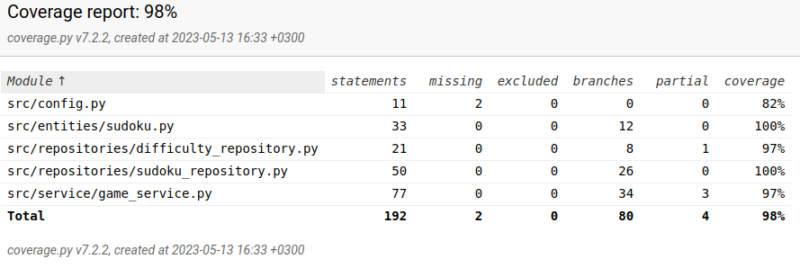

# Testausdokumentti

Ohjelmaa on testattu ysikkötasolla automatisoiduilla unittesteillä ja järjestelmää manuaalisesti.

## Yksikkö- ja integraatiotestit

### Sovelluslogiikka

Sovelluslogiikasta vastaavaa GameService -luokkaa testataan ```TestGameService``` -luokalla, jolle annetaan konstruktorikutsussa testausta varten tehdyt ```FakeSudokuRepository``` ja ```FakeDifficultyRepository``` -luokat, jotka tallentavat tietoa muistiin tiedoston kirjoittamisen sijasta.

### Repository luokat

SudokuRepository ja DifficultyRepository -luokkia testataan testiluokilla ```TestSudokuRepository``` ja ```TestDifficultyRepository```, joiden käyttämät tiedostot ovat vain testejä varten. Nämä tiedostojen nimet on määritelty _.env.test_ tiedostossa.


### Testikattavuus

Käyttöliittymää lukuunottamatta testauksen haarautumakattavuus on 98%.



## Järjestelmätestaus

Järjestelmätestaus on suoritettu manuaalisesti.

### Asennus ja konfigurointi

Sovellus on haettu ja sitä on testattu [käyttöohjeen](kayttoohje.md) kuvaamalla tavalla. Tiedostojen nimiä on myös muutettu _.env_ tiedostossa. 

### Toiminnalisuudet

Kaikki [määrittelydokumentin](vaatimusmaarittely.md) toiminnallisuudet on testattu ja tarkistettu.

## Sovellukseen jääneet laatuongelmat

Sovellus ei anna virheilmoituksia ja kaatuu, jos SudokuRepository tai DifficultyRepository luokkien käyttämiin tiedostoihin ei ole luku tai kirjoitusoikeutta.

