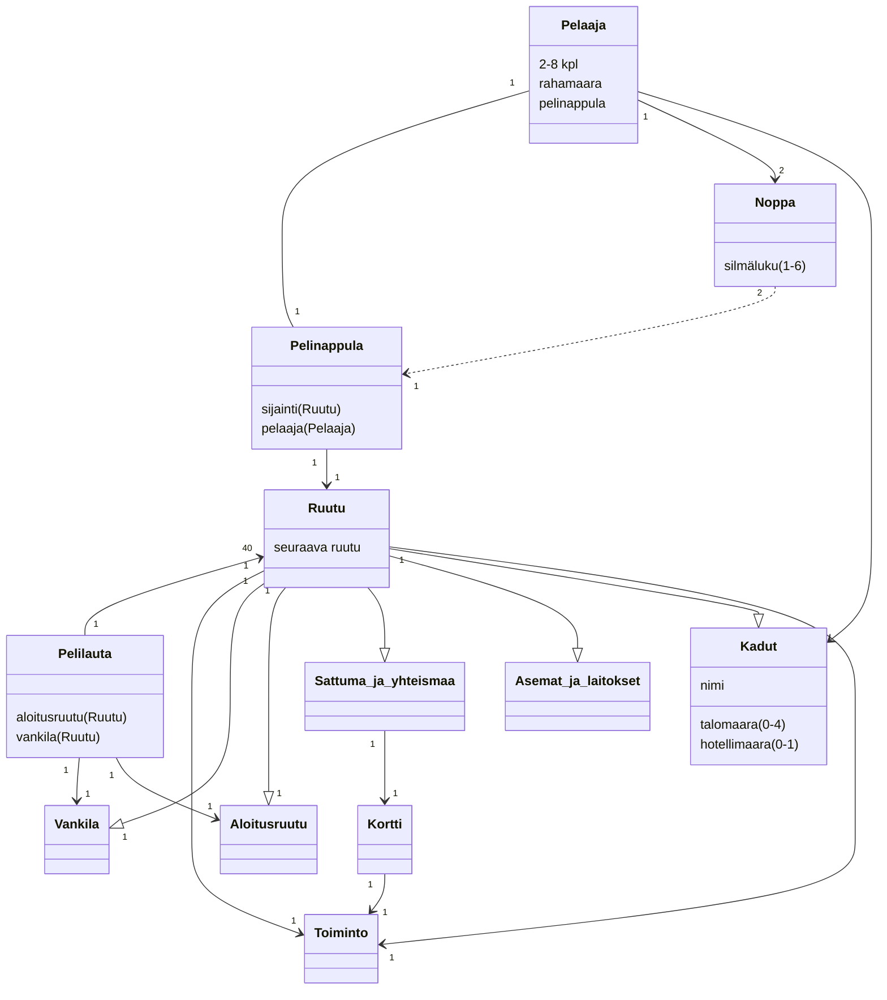

# Monopoly

```mermaid
classDiagram
  Ruutu "40" <-- "1" Pelilauta
  Pelaaja "1" -- "1" Pelinappula
  Pelaaja "1" --> "2" Noppa
  Noppa "2" ..> "1" Pelinappula
  Pelinappula "1" --> "1" Ruutu
  Ruutu "1" --> "1" Toiminto
  Ruutu "1" --|> "1" Vankila
  Ruutu "1" --|> "1" Aloitusruutu
  Ruutu --|> Sattuma_ja_yhteismaa
  Ruutu --|> Asemat_ja_laitokset
  Ruutu --|> Kadut
  Ruutu "1" --> "1" Toiminto
  Pelilauta "1" --> "1" Vankila
  Pelilauta "1" --> "1" Aloitusruutu
  Sattuma_ja_yhteismaa "1" --> "1" Kortti
  Kortti "1" --> "1" Toiminto
  Pelaaja --> Kadut
  class Pelilauta{
    aloitusruutu(Ruutu)
    vankila(Ruutu)
  }
  class Ruutu{
    seuraava ruutu 
  }
  class Pelinappula{
    sijainti(Ruutu)
    pelaaja(Pelaaja)
  }
  class Noppa{
    silmäluku (1-6)
  }
  class Pelaaja{
    2-8 kpl
    rahamaara
    pelinappula
  }
  class Toiminto
  class Aloitusruutu
  class Vankila
  class Sattuma_ja_yhteismaa
  class Asemat_ja_laitokset
  class Kadut{
    nimi
    talomaara(0-4)
    hotellimaara(0-1)
  }
  class Kortti

```
