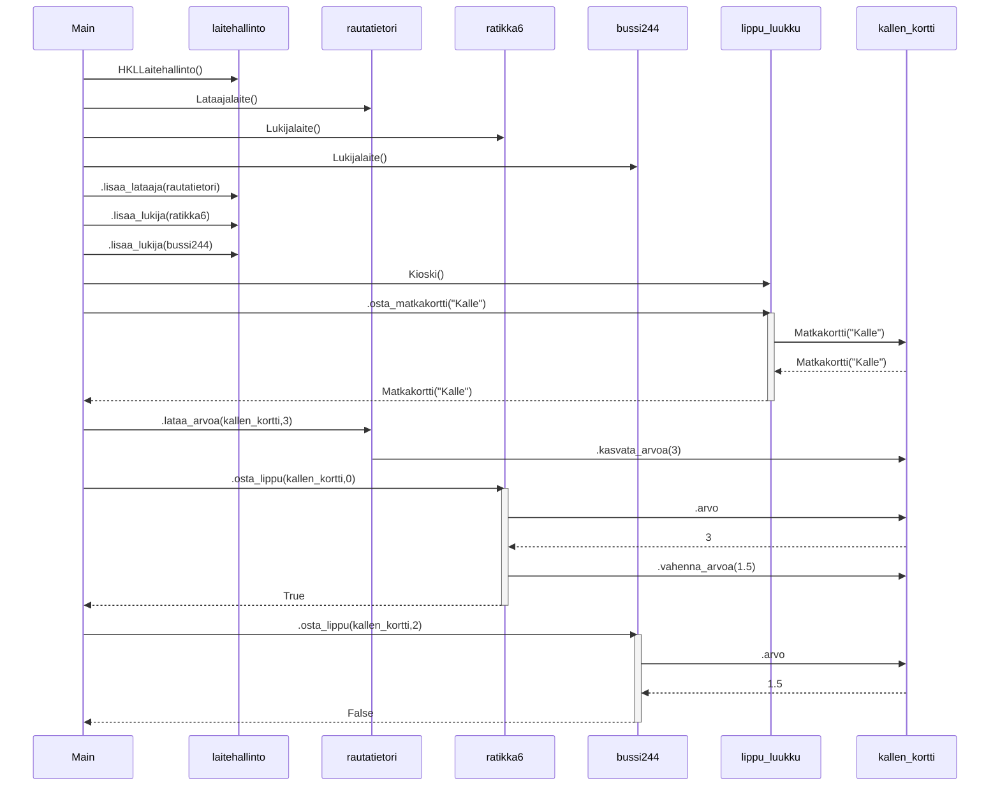

```mermaid

sequenceDiagram
  Main ->> laitehallinto: HKLLaitehallinto()
  Main ->> rautatietori: Lataajalaite()
  Main ->> ratikka6: Lukijalaite()
  Main ->> bussi244: Lukijalaite()
  Main ->> laitehallinto: .lisaa_lataaja(rautatietori)
  Main ->> laitehallinto: .lisaa_lukija(ratikka6)
  Main ->> laitehallinto: .lisaa_lukija(bussi244)
  Main ->> lippu_luukku: Kioski()
  Main ->> lippu_luukku: .osta_matkakortti("Kalle")
  activate lippu_luukku
  lippu_luukku ->> kallen_kortti: Matkakortti("Kalle")
  kallen_kortti -->> lippu_luukku: Matkakortti("Kalle")
  lippu_luukku -->> Main: Matkakortti("Kalle")
  deactivate lippu_luukku
  Main ->> rautatietori: .lataa_arvoa(kallen_kortti,3)
  rautatietori ->> kallen_kortti: .kasvata_arvoa(3)
  Main ->> ratikka6: .osta_lippu(kallen_kortti,0)
  activate ratikka6
  ratikka6 ->> kallen_kortti: .arvo
  kallen_kortti -->> ratikka6: 3
  ratikka6 ->> kallen_kortti: .vahenna_arvoa(1.5)
  ratikka6 -->> Main: True
  deactivate ratikka6
  Main ->> bussi244: .osta_lippu(kallen_kortti,2)
  activate bussi244
  bussi244 ->> kallen_kortti: .arvo
  kallen_kortti -->> bussi244: 1.5
  bussi244 -->> Main: False
  deactivate bussi244
  
```
